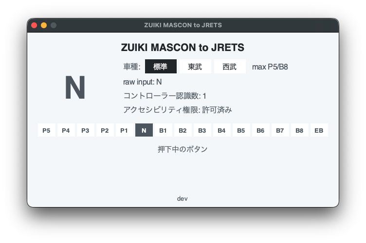

# ZUIKI-MASCON-to-JRETS

JR東日本トレインシミュレータ (JRETS) をズイキマスコンで操作できるようにするための非公式MODです。

JRETSは2024年5月からズイキマスコンを公式にサポートするようになりましたが、その後サービスが開始されたGeForce NOW版では非対応となっています。この非公式MODでは、ズイキマスコンからの入力をキーボード入力にマッピングすることで、擬似的にGeForce NOW版でもズイキマスコンで操作できるようにします。

なおGeForce NOW版でない通常版についても、ズイキマスコンの公式サポートが何らかの理由で動作しなくなった場合に、このMODを利用することで操作できるようになる可能性があります。

1ハンドル車と2ハンドル車の両方で使用でき、ボタンの長押しにも対応しています。

## 動作環境

GeForce NOW版のJRETSをmacOSおよびLinuxから操作できるように開発しています。以下の環境での動作を確認しています。

- macOS
  - Mac mini (2024)
  - macOS Tahoe 26.4.1
- Linux
  - Ubuntu 26.04 LTS (on VMware Fusion)
- uv
- ズイキマスコン ZKNS-013
- JR東日本トレインシミュレータ Ver. 1.0.1.689
- GeForce NOW 2.0.77.157

Windowsでは動作を確認していません。

## 使い方

### macOSでアプリケーションをダウンロードして開く場合

1. [最新のRelease](https://github.com/hiroto7/ZUIKI-MASCON-to-JRETS/releases/latest)で ZUIKI-MASCON-to-JRETS.app.zip をダウンロードする
2. ダウンロードしたファイルを展開し、 ZUIKI-MASCON-to-JRETS.app を起動する
   - 「Appleは、“ZUIKI-MASCON-to-JRETS”にMacに損害を与えたり、プライバシーを侵害する可能性のあるマルウェアが含まれていないことを検証できませんでした」と警告され起動できない場合、 https://support.apple.com/ja-jp/guide/mac-help/mh40616/mac の手順に従って開く
   - 「アクセシビリティ機能を使用してこのコンピュータを制御することを求めています」と表示された場合は、アクセスを許可する
3. ステータスウィンドウが表示されたことを確認し、JRETSの運転画面に進む
   - 東武・西武の車両を運転する場合は、ステータスウィンドウで「東武」または「西武」を選択する
   - 「アクセシビリティ権限: 未許可」と表示されている場合、「設定を開く」ボタンからシステム設定を開き、ZUIKI-MASCON-to-JRETS を許可する
4. 一度マスコンをNまたはEBに合わせる
5. 運転を開始する
6. 終了方法：ステータスウィンドウを閉じる



### コマンドラインから実行する場合

<details>
<summary>コマンドラインで実行する手順</summary>

1. uvをインストールする
   - https://docs.astral.sh/uv/getting-started/installation/
2. リポジトリをクローンしてパッケージをインストールする
   ```bash
   git clone https://github.com/hiroto7/ZUIKI-MASCON-to-JRETS.git
   cd ZUIKI-MASCON-to-JRETS
   uv sync --no-dev
   ```
3. main.py を実行する
   ```bash
   uv run python main.py --no-gui
   ```

   - Linuxで `Authorization required` というエラーが出る場合は、次のコマンドを実行してから再度 main.py を実行する
     ```bash
     xhost +SI:localuser:$(whoami)
     ```
   - Macでアクセシビリティ権限が未許可という警告が表示される場合、システム設定 > プライバシーとセキュリティ > アクセシビリティで使用中のアプリまたはターミナルを許可する
   - 東武・西武の車両を運転する場合は、車両に合わせて `--profile` を指定する
     ```bash
     uv run python main.py --no-gui --profile tobu
     uv run python main.py --no-gui --profile seibu
     ```
4. この状態でJRETSの運転画面に進み、一度マスコンをNまたはEBに合わせる
5. 運転を開始する
6. 終了方法：ターミナルに戻り、 <kbd>control</kbd> + <kbd>c</kbd> を押す

</details>

## トラブルシューティング

### macOSでJRETS側が反応しない場合

まず、下記を確認してください。

- ZUIKI-MASCON-to-JRETSのステータスウィンドウ（ノッチ段数や押下中のボタンが表示される画面）は開いているか
- 「コントローラー認識数: 1」と表示されているか
- 表示されるノッチ段数が、ズイキマスコンの動きに合わせて変化するか
- 「アクセシビリティ権限: 許可済み」と表示されているか
- 画面下部に表示されるバージョンが、[最新のRelease](https://github.com/hiroto7/ZUIKI-MASCON-to-JRETS/releases/latest)のバージョンと一致しているか

「アクセシビリティ権限: 未許可」と表示される場合は、以下を試してみてください。

1. 「アクセシビリティ権限: 未許可」の隣の「システム設定で許可する」ボタンを押す
   - または、システム設定 > プライバシーとセキュリティ > アクセシビリティを開く
2. 一覧にZUIKI-MASCON-to-JRETSの項目が表示されていて、なおかつオンの状態になっていることを確認する
   - オフになっていればオンにする
3. オンにしても解消しない場合、一覧からZUIKI-MASCON-to-JRETSを削除する
   - ZUIKI-MASCON-to-JRETSを選択し、一覧左下の削除ボタンをクリックする
4. ZUIKI-MASCON-to-JRETSを再起動し、権限の許可をやり直す
5. それでも解消しない場合、下記コマンドでmacOS全体のアクセシビリティ権限をリセットする
   - 注意：他アプリのアクセシビリティ権限もリセットされます
   ```bash
   tccutil reset Accessibility
   ```
6. 改めてZUIKI-MASCON-to-JRETSを再起動し、権限の許可をやり直す

## ボタンのマッピング

デフォルトのマッピングは、通常版（ダウンロード版）のズイキマスコンを使用したときと同じ挙動となるよう設定しています。例えば、公式サポートで「警笛（2段目）」に対応するAボタンは、キーボード操作で同じ意味となる <kbd>enter</kbd> キーにマッピングされます。同様に、「連絡ブザースイッチ」に対応する左ボタンは、 <kbd>b</kbd> キーにマッピングされます。なおHOMEボタンとキャプチャーボタンに限っては、GeForce Nowアプリのキーボードショートカットにマッピングされています。

デフォルトのマッピングの場合、公式サポートと同じ挙動となるのは運転画面のみです。メニュー画面では左右移動などの操作ができないため、キーボードやマウスを使用する必要があります。

このマッピングは mascon_controller.py 内の `MAPPING_TO_KEYBOARD` を編集することでカスタマイズできます。ただしZLボタンにはマッピングを設定できません。
